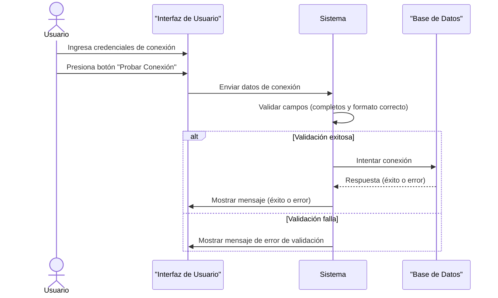
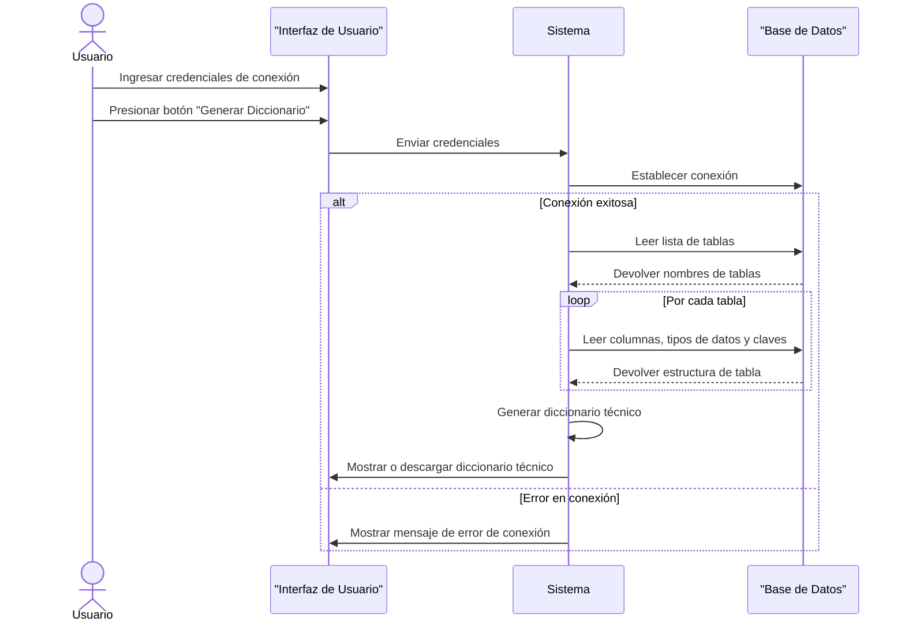
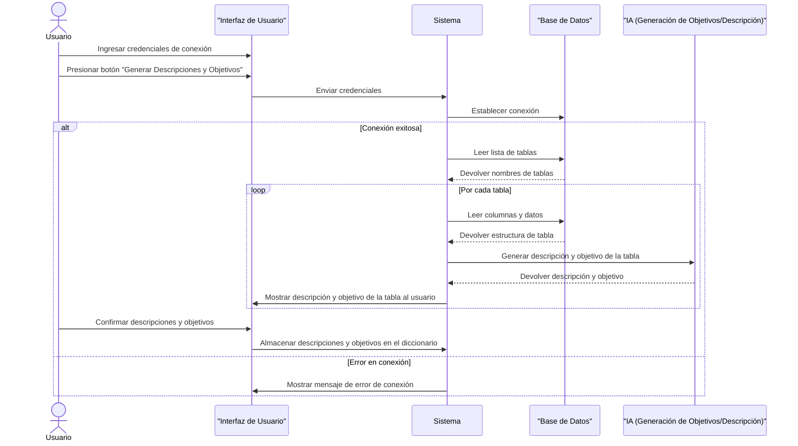
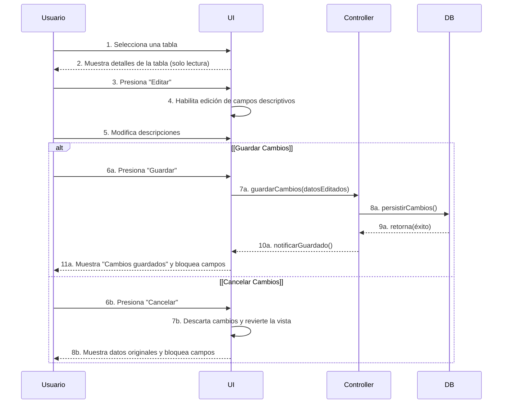
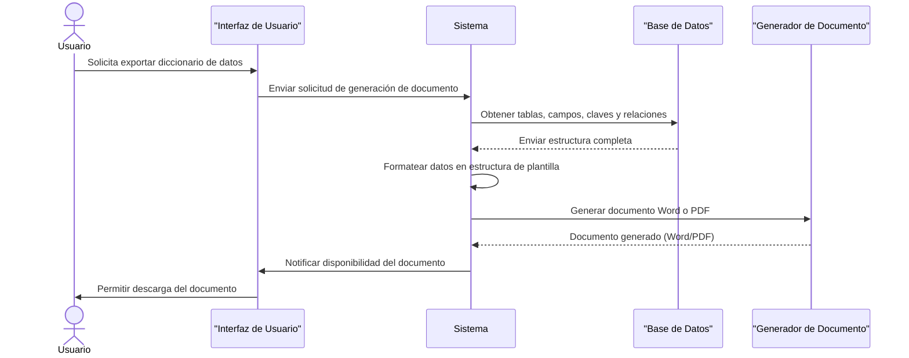
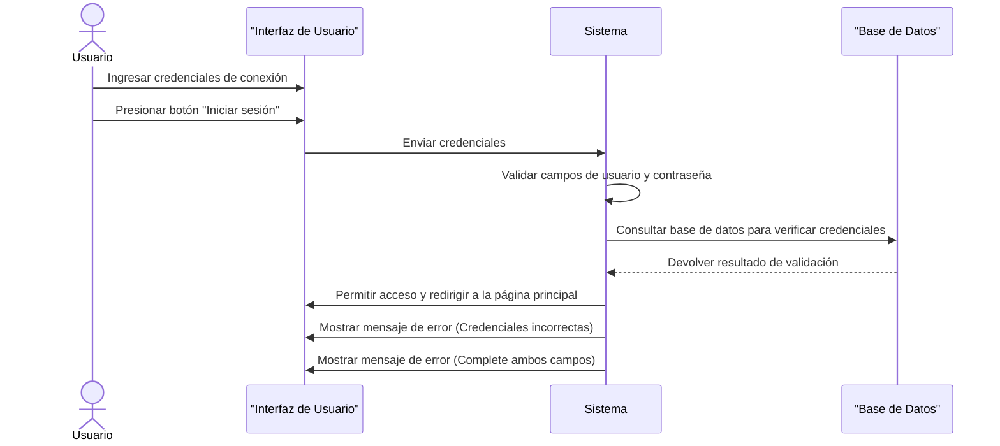
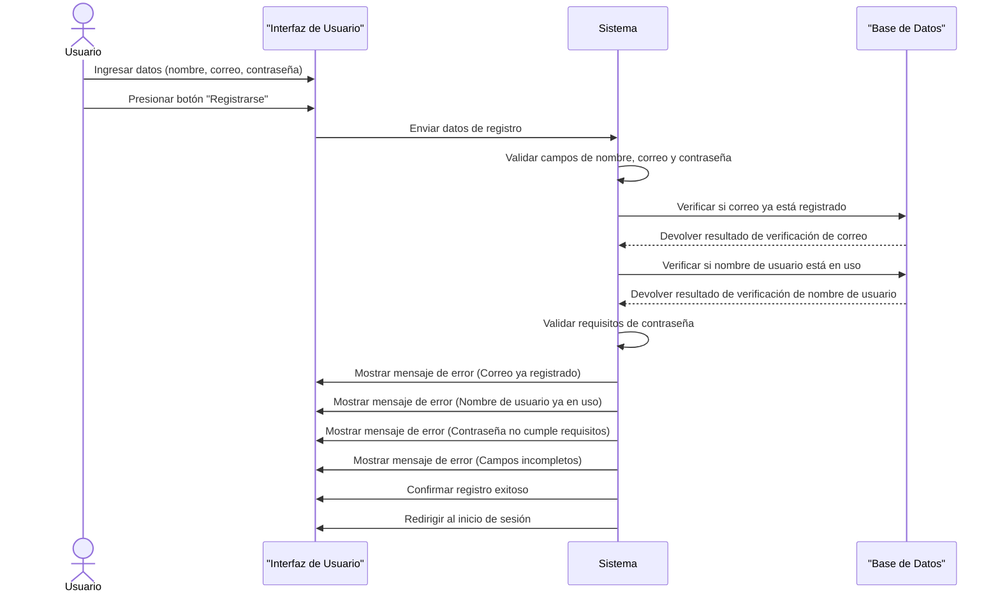

# UNIVERSIDAD PRIVADA DE TACNA
## FACULTAD DE INGENIERÍA
### Escuela Profesional de Ingeniería de Sistemas

 

# Aplicación para la Generación Automatizada de un Diccionario de Datos

**Curso:** Patrones de Software

**Docente:** Mag. Patrick Cuadros Quiroga

**Integrantes:**

*   Daleska Nicolle Fernandez Villanueva (2021070308)
*   Andree Sebastián Flores Meléndez (2017057494)
*   Mario Antonio Flores Ramos (2018000597)

 

**Tacna – Perú**
**2025**

---

### CONTROL DE VERSIONES
| Versión | Hecha por | Revisada por | Aprobada por | Fecha      | Motivo           |
|---------|-----------|--------------|--------------|------------|------------------|
| 1.0     | DFV       | AFM          | MFR          | 11/03/2025 | Versión Original |

---

 

# Aplicación para la Generación Automatizada de un Diccionario de Datos
## Documento de Especificación de Requerimientos de Software
### Versión 2.0

 

### CONTROL DE VERSIONES
| Versión | Hecha por | Revisada por | Aprobada por | Fecha      | Motivo           |
|---------|-----------|--------------|--------------|------------|------------------|
| 2.0     | AFM       | AFM          | MFR          | 02/05/2050 | Versión Original |

---

## ÍNDICE GENERAL
- [INTRODUCCIÓN](#introducción)
  - [I. Generalidades de la Empresa](#i-generalidades-de-la-empresa)
  - [II. Visionamiento de la Empresa](#ii-visionamiento-de-la-empresa)
- [III. Análisis de Procesos](#iii-análisis-de-procesos)
- [IV. Especificación de Requerimientos de Software](#iv-especificación-de-requerimientos-de-software)
- [V. Fase de Desarrollo](#v-fase-de-desarrollo)
- [CONCLUSIONES](#conclusiones)
- [RECOMENDACIONES](#recomendaciones)
- [BIBLIOGRAFÍA](#bibliografía)
- [WEBGRAFÍA](#webgrafía)

---

## INTRODUCCIÓN

### I. Generalidades de la Empresa
#### 1. Nombre de la Empresa
El nombre de la empresa es **DocuDB**.

#### 2. Visión
Convertirnos en una startup líder en el desarrollo de soluciones tecnológicas innovadoras y automatizadas que impulsen la eficiencia, calidad y competitividad de empresas, estudiantes y profesionales del sector TI a nivel nacional y regional.

#### 3. Misión
Diseñar y ofrecer productos tecnológicos que resuelvan problemas comunes en el desarrollo de software, automatización de procesos, gestión de datos y productividad digital, con foco en la simplicidad, eficiencia y accesibilidad.

#### 4. Organigrama
> *<Diagrama del Organigrama a ser insertado aquí>*

### II. Visionamiento de la Empresa
#### 1. Descripción del Problema
Hoy en día la mayoría de desarrolladores y administradores de bases de datos tienen que documentar manualmente la estructura de sus bases de datos. Esto no solo es tardado y tedioso, sino que también aumenta las probabilidades de cometer errores o de que la documentación no esté actualizada. Además, la falta de documentación estructurada complica el mantenimiento de sistemas y puede hacer más difícil que otros desarrolladores entiendan cómo funciona la base de datos. Este proyecto busca resolver estas problemáticas mediante el desarrollo de una Aplicación Web para la Generación Automatizada de Diccionarios de Datos.

#### 2. Objetivos de Negocios
*   Ofrecer una solución eficiente y automatizada para la documentación de bases de datos, que elimine procesos manuales y reduzca errores.
*   Posicionar nuestra startup como una herramienta confiable para desarrolladores, DBA y estudiantes.
*   Generar valor agregado a través de funcionalidades adicionales como visualización y exportación.
*   Abrir oportunidades de negocio ofreciendo el sistema como producto SaaS para instituciones académicas y empresas.

#### 3. Objetivos de Diseño
*   Diseñar una interfaz intuitiva y amigable.
*   Implementar un sistema modular que permita escalar nuevas funciones.
*   Asegurar una arquitectura técnica sólida que garantice rendimiento y seguridad.
*   Incluir formatos de exportación flexibles para el diccionario generado.

#### 4. Alcance del proyecto
*   Compatibilidad inicial con bases de datos relacionales y no relacionales.
*   Extracción automática de metadatos (tablas, columnas, tipos de datos, etc.).
*   Generación del diccionario en formatos como PDF y Word.
*   Interfaz de usuario amigable para usuarios técnicos y estudiantes.
*   Funcionalidades básicas de seguridad para proteger el acceso.

#### 5. Viabilidad del Sistema
El sistema es totalmente viable porque se puede desarrollar con las tecnologías y conocimientos actuales. Su implementación requiere inversión en servidores y mantenimiento. Será una herramienta útil para estudiantes, profesionales y empresas. Solo será necesario asegurarse de cumplir con las normas de protección de datos.

#### 6. Información obtenida del Levantamiento de Información
Durante el levantamiento de información, se realizaron entrevistas y encuestas a estudiantes y desarrolladores. Se identificó que la mayoría documenta manualmente sus bases de datos, lo que genera retrasos y errores. Los usuarios manifestaron la necesidad de una solución que automatice este proceso de forma rápida, visual y accesible.

---

### III. Análisis de Procesos
#### 1. Diagrama del Proceso Actual – Diagrama de actividades
> *<Diagrama a ser insertado aquí>*

#### 2. Diagrama del Proceso Propuesto – Diagrama de actividades Inicial
> *<Diagrama a ser insertado aquí>*

---

### IV. Especificación de Requerimientos de Software
#### 1. Cuadro de Requerimientos funcionales Inicial
| ID | Nombre del Requerimiento | Descripción | Prioridad |
| :--- | :--- | :--- | :--- |
| **RF-001** | Validación y conexión a base de datos | La aplicación debe permitir al usuario ingresar los datos de conexión, validarlos y establecer conexión, mostrando mensajes claros. | Alta |
| **RF-002** | Extracción automática de estructura de tablas | El sistema debe extraer automáticamente el nombre, columnas, tipo de datos, claves y relaciones de todas las tablas. | Alta |
| **RF-003** | Generación automática de descripciones con IA | La aplicación debe generar descripciones y objetivos para cada tabla usando IA y permitir al usuario confirmar los resultados. | Alta |
| **RF-004** | Visualización estructurada tipo plantilla | El sistema debe mostrar cada tabla en una plantilla visual con el nombre, descripción, campos, claves y relaciones. | Alta |
| **RF-005** | Exportación del diccionario a Word o PDF | El sistema debe exportar el diccionario de datos completo a un documento en formato Word o PDF. | Alta |

#### 2. Cuadro de Requerimientos No funcionales
| ID | Nombre del Requerimiento | Descripción | Prioridad |
| :--- | :--- | :--- | :--- |
| **RNF-001** | Rendimiento | El sistema debe generar los documentos en menos de 10 segundos para bases de datos medianas. | Alta |
| **RNF-002** | Usabilidad | La interfaz debe ser intuitiva, permitiendo su uso sin necesidad de formación técnica previa. | Media |
| **RNF-003** | Portabilidad | El sistema debe funcionar en navegadores modernos (Chrome, Firefox, Edge) sin necesidad de instalación. | Alta |
| **RNF-004** | Mantenibilidad | El sistema debe estar desarrollado siguiendo buenas prácticas que faciliten su mantenimiento y escalabilidad. | Alta |

#### 3. Cuadro de Requerimientos funcionales Final
| ID | Nombre del Requisito | Descripción de Requisito | Prioridad |
| :--- | :--- | :--- | :--- |
| **RF-001**|Registro de Usuario|El sistema debe permitir a los usuarios registrarse proporcionando un nombre, correo electrónico y contraseña.|Alta|
| **RF-002**|Validación de Correo Electrónico y Nombre de Usuario|El sistema debe validar que el correo electrónico y el nombre de usuario no estén ya registrados en el sistema.|Alta|
| **RF-003**|Validación de Contraseña|El sistema debe validar que la contraseña cumpla con requisitos mínimos de seguridad.|Alta|
| **RF-004**|Inicio de Sesión|El sistema debe permitir a los usuarios iniciar sesión utilizando un nombre de usuario o correo electrónico y una contraseña.|Alta|
| **RF-005**|Mensaje de Error en Inicio de Sesión|El sistema debe mostrar un mensaje de error si las credenciales de inicio de sesión son incorrectas.|Alta|
| **RF-006**|Recuperación de Contraseña|El sistema debe permitir que el usuario recupere su contraseña mediante un enlace de recuperación.|Alta|
| **RF-007**|Ingreso de Credenciales de Conexión|El sistema debe permitir a los usuarios ingresar credenciales de conexión para conectarse a la base de datos.|Alta|
| **RF-008**|Validación de Campos de Conexión|El sistema debe validar que los campos de conexión estén completos.|Alta|
| **RF-009**|Validación de Formato de Credenciales de Conexión|El sistema debe validar que el formato de las credenciales de conexión sea correcto.|Alta|
| **RF-010**|Intento de Conexión a la Base de Datos|El sistema debe intentar conectar a la base de datos y mostrar un mensaje de éxito o error.|Alta|
| **RF-011**|Guardar Credenciales de Conexión|El sistema debe permitir que el usuario guarde las credenciales de conexión para futuras sesiones.|Media|
| **RF-012**|Extracción de Estructura de la Base de Datos|El sistema debe extraer automáticamente la estructura de la base de datos.|Alta|
| **RF-013**|Generación de Diccionario Técnico|El sistema debe generar un diccionario técnico organizado.|Alta|
| **RF-014**|Visualización de Tablas en Formato de Plantilla|El sistema debe permitir a los usuarios visualizar las tablas y sus detalles en formato de ficha.|Alta|
| **RF-015**|Generación de Descripción de Tablas|El sistema debe generar una descripción breve para cada tabla.|Alta|
| **RF-016**|Generación de Objetivo para Tablas|El sistema debe usar IA para generar un objetivo para cada tabla.|Alta|
| **RF-017**|Revisión de Descripciones y Objetivos|El sistema debe mostrar las descripciones generadas al usuario para su revisión.|Alta|
| **RF-018**|Almacenamiento de Descripciones y Objetivos Generados|El sistema debe permitir al usuario almacenar las descripciones y objetivos generados.|Alta|
| **RF-019**|Visualización de Plantillas de Tablas|El sistema debe mostrar cada tabla en formato de plantilla tipo ficha.|Alta|
| **RF-020**|Navegación entre Plantillas de Tablas|El sistema debe permitir al usuario navegar entre las fichas de las tablas.|Alta|
| **RF-021**|Presentación Clara y Ordenada de la Información|El sistema debe presentar la información de manera clara y ordenada.|Alta|
| **RF-022**|Generación de Documento en Word o PDF|El sistema debe permitir generar un documento en Word o PDF.|Alta|
| **RF-023**|Plantilla Profesional para Documento|El sistema debe seguir una plantilla estandarizada y profesional.|Alta|
| **RF-024**|Descarga de Documento Generado|El sistema debe permitir a los usuarios descargar el archivo generado.|Alta|
| **RF-025**|Generación Completa del Diccionario de Datos|El sistema debe generar el documento con la estructura completa del diccionario.|Alta|
| **RF-026**|Habilitar modo de edición en la ficha de tabla|El sistema debe proporcionar un control para activar la edición de los campos descriptivos.|Alta|
| **RF-027**|Edición del contenido de las tablas extraídas|El sistema debe permitir al usuario modificar los campos de texto descriptivos.|Alta|
| **RF-028**|Guardar cambios de la edición|El sistema debe proporcionar un botón "Guardar" para almacenar los cambios.|Alta|
| **RF-029**|Cancelar edición y descartar cambios|El sistema debe ofrecer una opción "Cancelar" para descartar cambios no guardados.|Alta|

#### 4. Reglas de Negocio
La funcionalidad principal del sistema se centra en la automatización completa del proceso de documentación de bases de datos. La aplicación deberá permitir la conexión tanto a sistemas de bases de datos relacionales como no relacionales, y una vez establecida dicha conexión, el proceso de extracción de la estructura y los metadatos se ejecutará de forma totalmente automática.

Una regla fundamental para garantizar la seguridad e integridad es que la aplicación operará en modo de solo lectura. Bajo ninguna circunstancia modificará la base de datos de origen. Además, si procesa una base de datos con un diseño deficiente, no interrumpirá su funcionamiento, sino que generará un diccionario con la información que logre extraer.

---

### V. Fase de Desarrollo
#### 1. Perfiles de Usuario
*   **Estudiante / Desarrollador:** Usuario final principal que necesita documentar proyectos académicos o entender una base de datos existente.
*   **Docente:** Profesor que utiliza la herramienta para evaluar la documentación en los proyectos de los estudiantes.
*   **Administrador del Sistema:** Responsable técnico de mantener la plataforma funcionando.

#### 2. Modelo Conceptual
##### a. Diagrama de Paquetes
> 

##### b. Diagrama de Casos de Uso
> 

##### c. Escenarios de Caso de Uso (narrativa)
**Caso de uso: Extraer Estructura Automáticamente**
| | |
| :--- | :--- |
| **Actores** | Usuario |
| **Propósito** | Automatizar la lectura del esquema de una base de datos para generar un diccionario técnico completo. |
| **Tipo** | Principal |
| **Descripción** | El usuario inicia el proceso de extracción. El sistema lee la lista de tablas y, para cada una, extrae sus columnas, tipos de datos y claves. |
| **Precondición** | Conexión exitosa con la base de datos externa. |
| **Curso normal de eventos** | **Acciones de actores:** Presiona "Generar Diccionario".   **Acciones del sistema:** Conecta a la BD, solicita la lista de tablas, itera sobre cada una para leer su estructura, compila la información y la muestra en la interfaz. |

**Caso de uso: Generar Descripciones con IA**
| | |
| :--- | :--- |
| **Actores** | Usuario |
| **Propósito** | Enriquecer el diccionario de datos con descripciones y objetivos funcionales generados por una IA. |
| **Tipo** | Principal |
| **Descripción** | El sistema analiza cada tabla y envía su información a un servicio de IA, que devuelve descripciones y objetivos sugeridos para la revisión del usuario. |
| **Precondición** | El sistema ha extraído la estructura básica de la base de datos. |
| **Curso normal de eventos** | **Acciones de actores:** Presiona "Generar Descripciones", revisa y confirma los resultados.   **Acciones del sistema:** Envía datos de cada tabla a la IA, recibe y muestra las descripciones sugeridas, y las almacena al confirmarlas. |

**Caso de uso: Visualizar y Editar Descripciones**
| | |
| :--- | :--- |
| **Actores** | Usuario |
| **Propósito** | Permitir al usuario revisar y personalizar las descripciones dentro del diccionario de datos. |
| **Tipo** | Principal |
| **Descripción** | El usuario selecciona una tabla, activa un "modo de edición" para modificar descripciones y alias, y luego guarda o descarta los cambios. |
| **Precondición** | Se ha generado un diccionario de datos. |
| **Curso normal de eventos** | **Acciones de actores:** Selecciona tabla, presiona "Editar", modifica texto y presiona "Guardar" o "Cancelar".   **Acciones del sistema:** Muestra datos, habilita campos de edición, y persiste o descarta los cambios según la acción del usuario. |

**Caso de uso: Exportar Diccionario a Documento**
| | |
| :--- | :--- |
| **Actores** | Usuario |
| **Propósito** | Proporcionar un documento portátil (Word o PDF) del diccionario de datos final. |
| **Tipo** | Principal |
| **Descripción** | El sistema recopila la información final, la formatea usando una plantilla y genera un archivo para su descarga. |
| **Precondición** | Existe un diccionario de datos completo. |
| **Curso normal de eventos** | **Acciones de actores:** Solicita la exportación y descarga el archivo.   **Acciones del sistema:** Recopila datos, los formatea, genera el documento y habilita la descarga. |

**Caso de uso: Iniciar Sesión**
| | |
| :--- | :--- |
| **Actores** | Usuario |
| **Propósito** | Autenticar a un usuario registrado para otorgarle acceso seguro. |
| **Tipo** | Principal |
| **Descripción** | El usuario introduce sus credenciales, que el sistema valida contra su base de datos para conceder o denegar el acceso. |
| **Precondición** | El usuario posee una cuenta registrada. |
| **Curso normal de eventos** | **Acciones de actores:** Ingresa credenciales y presiona "Iniciar Sesión".   **Acciones del sistema:** Valida los datos y, si son correctos, permite el acceso. De lo contrario, muestra un error. |

**Caso de uso: Registrar Nuevo Usuario**
| | |
| :--- | :--- |
| **Actores** | Usuario (Visitante) |
| **Propósito** | Permitir a un nuevo usuario crear una cuenta personal. |
| **Tipo** | Principal |
| **Descripción** | Un nuevo usuario completa un formulario, el sistema valida los datos (unicidad, seguridad de contraseña) y crea la cuenta si todo es correcto. |
| **Precondición** | El usuario no está autenticado. |
| **Curso normal de eventos** | **Acciones de actores:** Ingresa datos y presiona "Registrarse".   **Acciones del sistema:** Realiza validaciones y, si son exitosas, crea el usuario y redirige al inicio de sesión. Si no, muestra un error. |

#### 3. Modelo Lógico
##### a. Analisis de Objetos
> *<Contenido a ser insertado aquí>*

##### b. Diagrama de Secuencia
- Conectar a la base de datos

- Extracción automática de estructura

- Generación de descripciones con IA 

- Visualizar y editar descripciones 

- Exportación del diccionario a Word o PDF

- Inicio de sesión para usuarios

- Registro de nuevos usuarios

##### c. Diagrama de Clases
> 

---

### CONCLUSIONES
*   **Automatización efectiva de documentación:** La aplicación simplifica considerablemente la gestión, mantenimiento y análisis de bases de datos.
*   **Utilidad académica y profesional:** Es una herramienta valiosa para estudiantes y profesionales.
*   **Visualización y comprensión mejorada:** Facilita una mejor comprensión de las estructuras de datos.
*   **Escalabilidad asegurada:** Su arquitectura permite incorporar nuevas funcionalidades a futuro.

### RECOMENDACIONES
*   **Optimizar rendimiento:** Refinar los algoritmos para bases de datos extensas.
*   **Implementar capacitación:** Desarrollar tutoriales para facilitar la adopción por nuevos usuarios.
*   **Fortalecer la seguridad:** Realizar auditorías periódicas y aplicar controles avanzados.

### BIBLIOGRAFÍA
*   Domínguez Vázquez, M. J. (2022). *Estructura argumental del nombre: Generación automática*. Estudios de Lingüística.
*   Rovira Esteva, S. (2024). *Base de datos con información detallada sobre las características de 51 diccionarios digitales de chino*. DataCite.

### WEBGRAFÍA
*   [¿Qué es un diccionario de datos y por qué es importante?](https://datos.gob.es/es/blog/que-es-un-diccionario-de-datos-y-por-que-es-importante)
*   [¿Qué es un Data Dictionary?](https://reveland.es/que-es-un-data-dictionary-definicion-y-ejemplos/)