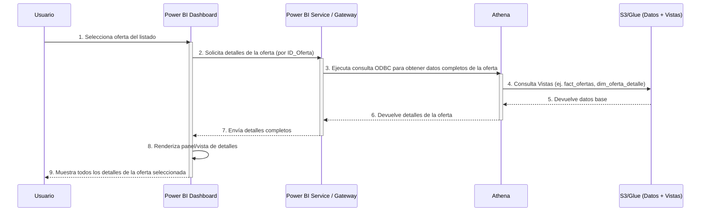
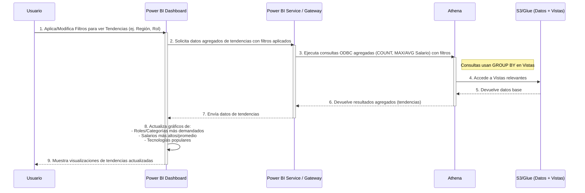
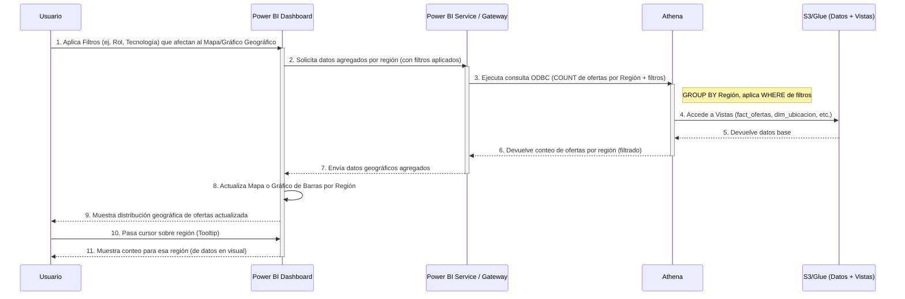
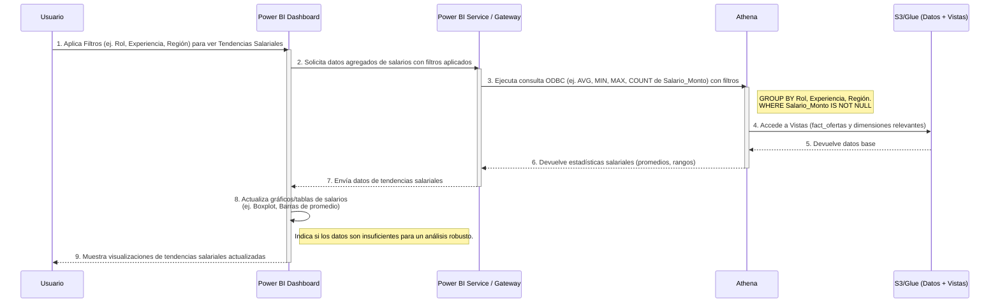

# UNIVERSIDAD PRIVADA DE TACNA
## FACULTAD DE INGENIERÍA
### Escuela Profesional de Ingeniería de Sistemas

---

# 📊 Plataforma de Análisis del Mercado Laboral Tecnológico

---

**Curso:** Inteligencia de Negocios

**Docente:** Mag. Patrick Cuadros Quiroga

**Integrantes:**

*   Daleska Nicolle Fernandez Villanueva (2021070308)
*   Andree Sebastian Flores Melendez (2017057494)
*   Mario Antonio Flores Ramos (2018000597)

---

Tacna – Perú
2025

---

## CONTROL DE VERSIONES
| Versión | Hecha por | Revisada por | Aprobada por | Fecha      | Motivo         |
| :------ | :-------- | :----------- | :----------- | :--------- | :------------- |
| 1.0     | MPV       | ELV          | ARV          | 10/10/2020 | Versión Original |

---
---

# Plataforma de Análisis del Mercado Laboral Tecnológico
## Documento de Arquitectura de Software

**Versión 1.0**

---

## CONTROL DE VERSIONES
| Versión | Hecha por | Revisada por | Aprobada por | Fecha      | Motivo         |
| :------ | :-------- | :----------- | :----------- | :--------- | :------------- |
| 1.0     | MPV       | ELV          | ARV          | 10/10/2020 | Versión Original |

---

## Contenido
1.  [INTRODUCCIÓN](#1-introducción)
    1.1. [Propósito (Diagrama 4+1)](#11-propósito-diagrama-41)
    1.2. [Alcance](#12-alcance)
    1.3. [Definición, siglas y abreviaturas](#13-definición-siglas-y-abreviaturas)
    1.4. [Organización del documento](#14-organización-del-documento)
2.  [OBJETIVOS Y RESTRICCIONES ARQUITECTÓNICAS](#2-objetivos-y-restricciones-arquitectónicas)
    2.1. [Requerimientos Funcionales](#211-requerimientos-funcionales)
    2.2. [Requerimientos No Funcionales – Atributos de Calidad](#212-requerimientos-no-funcionales--atributos-de-calidad)
    2.3. [Restricciones](#23-restricciones)
3.  [REPRESENTACIÓN DE LA ARQUITECTURA DEL SISTEMA](#3-representación-de-la-arquitectura-del-sistema)
    3.1. [Vista de Caso de uso](#31-vista-de-caso-de-uso)
        3.1.1. [Diagramas de Casos de uso](#311-diagramas-de-casos-de-uso)
    3.2. [Vista Lógica](#32-vista-lógica)
        3.2.1. [Diagrama de Subsistemas (paquetes)](#321-diagrama-de-subsistemas-paquetes)
        3.2.2. [Diagrama de Secuencia (vista de diseño)](#322-diagrama-de-secuencia-vista-de-diseño)
        3.2.3. [Diagrama de Colaboración (vista de diseño)](#323-diagrama-de-colaboración-vista-de-diseño)
        3.2.4. [Diagrama de Objetos](#324-diagrama-de-objetos)
        3.2.5. [Diagrama de Clases](#325-diagrama-de-clases)
        3.2.6. [Diagrama de Base de datos (modelo dimensional)](#326-diagrama-de-base-de-datos-modelo-dimensional)
    3.3. [Vista de Implementación (vista de desarrollo)](#33-vista-de-implementación-vista-de-desarrollo)
        3.3.1. [Diagrama de arquitectura software (paquetes/módulos)](#331-diagrama-de-arquitectura-software-paquetesmódulos)
        3.3.2. [Diagrama de arquitectura del sistema (Diagrama de componentes)](#332-diagrama-de-arquitectura-del-sistema-diagrama-de-componentes)
    3.4. [Vista de procesos](#34-vista-de-procesos)
        3.4.1. [Diagrama de Procesos del sistema (diagrama de actividad)](#341-diagrama-de-procesos-del-sistema-diagrama-de-actividad)
    3.5. [Vista de Despliegue (vista física)](#35-vista-de-despliegue-vista-física)
        3.5.1. [Diagrama de despliegue](#351-diagrama-de-despliegue)
4.  [ATRIBUTOS DE CALIDAD DEL SOFTWARE](#4-atributos-de-calidad-del-software)
    4.1. [Escenario de Funcionalidad](#escenario-de-funcionalidad)
    4.2. [Escenario de Usabilidad](#escenario-de-usabilidad)
    4.3. [Escenario de Confiabilidad](#escenario-de-confiabilidad)
    4.4. [Escenario de Rendimiento](#escenario-de-rendimiento)
    4.5. [Escenario de Mantenibilidad](#escenario-de-mantenibilidad)
    4.6. [Otros Escenarios](#otros-escenarios)

---

## 1. INTRODUCCIÓN

### 1.1. Propósito (Diagrama 4+1)
El enfoque arquitectónico de la "Plataforma de Análisis del Mercado Laboral Tecnológico" se basa en una adaptación del modelo 4+1 vistas de Kruchten, orientada a un sistema de Business Intelligence (BI) cuya interfaz principal es un dashboard analítico. El propósito de este documento es describir la arquitectura del software desde múltiples perspectivas para asegurar una comprensión integral del sistema, su diseño, implementación y despliegue.

*   **Vista Lógica (Modelo de Datos y Componentes de BI):** Define la estructura de los datos (esquema de estrella/copo de nieve implementado mediante vistas en Amazon Athena sobre datos en S3), las relaciones entre entidades (hechos y dimensiones), y las transformaciones o medidas clave (DAX en Power BI). Describe los componentes principales: el módulo de carga y limpieza (Streamlit, Python), el data lake (Amazon S3), el catálogo de datos (AWS Glue), el motor de consultas (Amazon Athena) y la herramienta de visualización (Power BI).
*   **Vista de Procesos (Flujos de Datos e Interacción del Usuario):** Detalla cómo los datos fluyen desde la carga inicial (CSV subido a Streamlit), pasando por la limpieza, almacenamiento en S3, catalogación en Glue, consulta en Athena, hasta la visualización en Power BI. También describe cómo los usuarios interactúan con el dashboard (filtros, selecciones, drill-downs).
*   **Vista Física/Despliegue (Infraestructura Cloud y Local):** Indica la infraestructura utilizada. Esto incluye los servicios de AWS (S3, Glue, Athena), la máquina donde se ejecuta el Power BI Gateway (si se usa para actualizaciones programadas), y el entorno donde se desarrolla y accede a Power BI Desktop y el servicio de Power BI.
*   **Vista de Escenarios/Casos de Uso (Perspectiva del Usuario):** Describe cómo los diferentes actores (estudiantes, profesionales TI, administradores) utilizan la plataforma para alcanzar sus objetivos, validando que la arquitectura soporta las funcionalidades clave.
*   **Vista de Implementación/Desarrollo (Módulos de Software):** Se enfoca en los componentes de software desarrollados: el script de Streamlit para la limpieza y carga, los scripts SQL para crear las vistas en Athena, y el archivo `.pbix` de Power BI que contiene el modelo de datos y las visualizaciones.

Este enfoque arquitectónico permite que el diseño de la plataforma sea modular, escalable y alineado con las necesidades de los usuarios, priorizando la robustez del pipeline de datos y la eficiencia del análisis.

### 1.2. Alcance
Este proyecto contempla el desarrollo de una plataforma para explorar y analizar datos del mercado laboral tecnológico en Perú, orientada a estudiantes, egresados y profesionales de carreras como Ingeniería de Sistemas, Desarrollo de Software, Ciencia de la Computación, Informática y Análisis de Datos. El sistema se centrará en la carga manual de datos de ofertas laborales (vía CSV), su posterior limpieza y estandarización, almacenamiento en un data lake en S3, catalogación con AWS Glue, modelado dimensional mediante vistas en Amazon Athena, y visualización interactiva a través de un dashboard en Power BI conectado vía ODBC. El alcance incluye la implementación de filtros, gráficos y KPIs para analizar tendencias de roles, tecnologías, salarios, requisitos educativos y distribución geográfica de las ofertas.

### 1.3. Definición, siglas y abreviaturas
*   **BI:** Business Intelligence (Inteligencia de Negocios)
*   **CSV:** Comma-Separated Values (Valores Separados por Comas)
*   **S3:** Amazon Simple Storage Service (Servicio de almacenamiento de objetos de AWS)
*   **AWS Glue:** Servicio ETL completamente gestionado que facilita la preparación y carga de datos.
*   **Glue Data Catalog:** Repositorio de metadatos persistente en AWS Glue.
*   **Glue Crawler:** Programa que se conecta a un almacén de datos (origen o destino), avanza por una lista priorizada de clasificadores para determinar el esquema de los datos y, a continuación, crea tablas de metadatos en el Catálogo de datos de Glue.
*   **Athena:** Servicio de consultas interactivo que facilita el análisis de datos directamente en Amazon S3 usando SQL estándar.
*   **SerDe:** Serializador/Deserializador.
*   **ODBC:** Open Database Connectivity (Conectividad Abierta de Bases de Datos).
*   **Power BI:** Herramienta de Microsoft para la visualización de datos y creación de dashboards interactivos.
*   **DAX:** Data Analysis Expressions (Lenguaje de fórmulas utilizado en Power BI, Analysis Services y Power Pivot en Excel).
*   **ETL:** Extract, Transform, Load (Extraer, Transformar, Cargar).
*   **DSN:** Data Source Name (Nombre de Origen de Datos).
*   **IAM:** AWS Identity and Access Management (Gestión de identidades y accesos de AWS).
*   **KPI:** Key Performance Indicator (Indicador Clave de Rendimiento).
*   **UI:** User Interface (Interfaz de Usuario).
*   **SK:** Surrogate Key (Clave Subrogada).
*   **PK:** Primary Key (Clave Primaria).
*   **FK:** Foreign Key (Clave Foránea).

### 1.4. Organización del documento
Este documento se organiza en secciones que describen los objetivos arquitectónicos, las diferentes vistas de la arquitectura del sistema (Casos de Uso, Lógica, Implementación, Procesos y Despliegue), y una evaluación de los atributos de calidad del software.

---

## 2. OBJETIVOS Y RESTRICCIONES ARQUITECTÓNICAS

### 2.1.1. Requerimientos Funcionales

| ID     | Descripción                                                                                                                                                                                             | Prioridad |
| :----- | :------------------------------------------------------------------------------------------------------------------------------------------------------------------------------------------------------ | :-------- |
| RF001  | El administrador sube un archivo CSV con nuevas ofertas laborales a la aplicación de limpieza (Streamlit), la cual procesa y estandariza los datos, y los sube al data lake (S3) para su posterior catalogación y consumo por el dashboard. | Alta      |
| RF002  | El sistema debe permitir al usuario visualizar una lista de ofertas laborales detalladas, mostrando al menos: título, empresa, ubicación, fecha de publicación, tipo de contrato y descripción.        | Alta      |
| RF003  | El sistema debe permitir al usuario filtrar la lista de ofertas laborales por ubicación geográfica (región).                                                                                          | Alta      |
| RF004  | El sistema debe permitir al usuario filtrar la lista de ofertas laborales por tipo de contrato.                                                                                                         | Alta      |
| RF005  | El sistema debe permitir al usuario filtrar la lista de ofertas laborales por nivel de experiencia requerido.                                                                                            | Alta      |
| RF006  | El sistema debe permitir al usuario filtrar la lista de ofertas laborales por lenguajes de programación específicos demandados.                                                                        | Alta      |
| RF007  | El sistema debe permitir al usuario filtrar la lista de ofertas laborales por herramientas o frameworks específicos demandados.                                                                          | Alta      |
| RF008  | El sistema debe mostrar un resumen visual de las habilidades y tecnologías (lenguajes, frameworks, herramientas, BBDD) más demandadas.                                                                    | Alta      |
| RF009  | El sistema debe permitir visualizar la distribución geográfica de las ofertas laborales.                                                                                                                   | Alta      |
| RF0010 | El sistema debe permitir al usuario filtrar o segmentar el análisis geográfico por tipo de modalidad de trabajo.                                                                                         | Alta      |
| RF011  | El sistema debe mostrar gráficos interactivos que presenten el rango o promedio salarial por especialización.                                                                                            | Alta      |
| RF012  | El sistema debe permitir filtrar o segmentar los gráficos de tendencias salariales por nivel de experiencia.                                                                                             | Alta      |
| RF013  | El sistema debe permitir filtrar o segmentar los gráficos de tendencias salariales por ubicación geográfica.                                                                                              | Media     |
| RF014  | El sistema debe mostrar un resumen visual de la distribución de ofertas laborales por nivel educativo requerido.                                                                                        | Alta      |
| RF015  | El sistema debe permitir al usuario ver el detalle completo de una oferta laboral seleccionada, incluyendo enlace a la fuente original si está disponible.                                                 | Alta      |

### 2.1.2. Requerimientos No Funcionales – Atributos de Calidad

| ID    | Descripcion                                                                                                     | Prioridad | Atributo de Calidad |
| :---- | :-------------------------------------------------------------------------------------------------------------- | :-------- | :------------------ |
| RNF01 | El dashboard debe cargar los datos iniciales y responder a las interacciones de filtro en menos de 5 segundos.     | Alta      | Rendimiento         |
| RNF02 | La interfaz del dashboard debe ser intuitiva y fácil de usar para usuarios con conocimientos básicos de BI.     | Alta      | Usabilidad          |
| RNF03 | El proceso de carga y limpieza de datos debe ser robusto, manejando errores comunes en los CSV de entrada.        | Alta      | Confiabilidad       |
| RNF04 | El sistema debe ser capaz de manejar un volumen creciente de ofertas laborales (hasta X mil registros) sin degradación significativa del rendimiento. | Media     | Escalabilidad       |
| RNF05 | El pipeline de datos (S3, Glue, Athena) y el modelo de Power BI deben ser mantenibles y modificables para futuras mejoras. | Media     | Mantenibilidad      |
| RNF06 | Los datos sensibles (si los hubiera en el futuro, actualmente no se manejan) deben estar protegidos.                 | Baja      | Seguridad           |

### 2.3. Restricciones
*   El desarrollo se realizará utilizando principalmente Python (Streamlit, Pandas) para la limpieza, servicios de AWS (S3, Glue, Athena) para el backend de datos, y Microsoft Power BI para la capa de visualización.
*   La conexión entre Power BI y Athena se realizará mediante un driver ODBC.
*   La carga inicial de datos se realizará mediante la subida manual de archivos CSV a la aplicación Streamlit. No se contempla web scraping automatizado en esta fase.
*   El proyecto se enfoca en el mercado laboral tecnológico de Perú.
*   El equipo cuenta con un tiempo limitado de X meses para el desarrollo e implementación.
*   Se utilizarán los servicios de AWS dentro de los límites de la capa gratuita o con un presupuesto mínimo, si aplica.

---

## 3. REPRESENTACIÓN DE LA ARQUITECTURA DEL SISTEMA

### 3.1. Vista de Caso de uso
Esta sección describe las funcionalidades clave del sistema desde la perspectiva de los actores que interactúan con él.

#### 3.1.1. Diagramas de Casos de uso

- Visualizar Distribución Geográfica de las Ofertas Laborales
```mermaid
sequenceDiagram
    participant Usuario
    participant Dashboard as Power BI Dashboard
    participant Backend as Power BI Service / Gateway
    participant Athena
    participant S3Data as S3/Glue (Datos + Vistas)


    Usuario->>Dashboard: 1. Abre Dashboard / Aplica Filtros
    activate Dashboard
    Dashboard->>Backend: 2. Solicita datos (con filtros)
    activate Backend
    Backend->>Athena: 3. Ejecuta consulta ODBC filtrada
    activate Athena
    Athena->>S3Data: 4. Consulta Vistas sobre datos de S3
    activate S3Data
    S3Data-->>Athena: 5. Devuelve datos base
    deactivate S3Data
    Athena-->>Backend: 6. Devuelve resultados de consulta
    deactivate Athena
    Backend-->>Dashboard: 7. Envía datos procesados/filtrados
    deactivate Backend
    Dashboard->>Dashboard: 8. Actualiza visualizaciones
    Dashboard-->>Usuario: 9. Muestra ofertas filtradas
    deactivate Dashboard # Se desactiva aquí después del flujo principal


    alt Limpiar Filtros
        Usuario->>Dashboard: 10. Limpia Filtros
        activate Dashboard # Activar Dashboard para esta interacción
        Dashboard->>Backend: 11. Solicita datos completos
        activate Backend
        Backend->>Athena: 12. Ejecuta consulta ODBC sin filtros
        activate Athena
        Athena->>S3Data: 13. Consulta Vistas
        activate S3Data
        S3Data-->>Athena: 14. Devuelve datos base
        deactivate S3Data
        Athena-->>Backend: 15. Devuelve resultados completos
        deactivate Athena
        Backend-->>Dashboard: 16. Envía datos completos
        deactivate Backend
        Dashboard->>Dashboard: 17. Actualiza visualizaciones
        Dashboard-->>Usuario: 18. Muestra todas las ofertas
        deactivate Dashboard # Desactivar Dashboard al final del bloque alt
    end
```

- Filtrar por Categorías de Empleo


- Identificación de Roles y Tecnologías en Auge


- Visualización Geográfica de la Demanda Laboral


- Análisis de Tendencias Salariales


### 3.2. Vista Lógica
Describe los principales componentes de software y sus interacciones, incluyendo la estructura de datos.


#### 3.2.1. Diagrama de Subsistemas (paquetes)
*   **Módulo de Interfaz de Usuario y Carga de Datos:** Implementado con Streamlit y Python. Responsable de la interacción con el administrador para la subida de archivos CSV y la ejecución inicial de la limpieza de datos.
*   **Módulo de Almacenamiento de Datos Crudos y Procesados:** Amazon S3. Utilizado como data lake para almacenar los CSV originales subidos y los CSV/Parquet limpios y estandarizados.
*   **Módulo de Catálogo de Metadatos:** AWS Glue Data Catalog. Mantiene el esquema y la ubicación de los datos procesados en S3, permitiendo que sean consultables.
*   **Módulo de Procesamiento y Consultas Ad-hoc:** Amazon Athena. Motor de consultas SQL que opera sobre los datos en S3, utilizando el Catálogo de Glue. Aquí se definen las Vistas que conforman el modelo dimensional.
*   **Módulo de Conectividad de Datos:** Driver ODBC para Athena. Facilita la conexión entre Power BI y Amazon Athena.
*   **Módulo de Business Intelligence y Visualización:** Microsoft Power BI (Desktop y Service). Utilizado para importar/consultar datos desde Athena, modelar las relaciones dimensionales, crear medidas DAX y diseñar los dashboards interactivos.
*   **(Opcional) Módulo de Orquestación ETL:** AWS Glue ETL (si se automatiza la carga de S3 a un data warehouse más formal) o AWS Lambda (para triggers).

#### 3.2.2. Diagrama de Secuencia (vista de diseño)

*[INSERTAR AQUÍ TU DIAGRAMA DE SECUENCIA PARA FILTRADO DE OFERTAS (Mermaid o imagen)]*

*(Añadir más diagramas de secuencia para otros casos de uso críticos)*

#### 3.2.3. Diagrama de Colaboración (vista de diseño)
*(Opcional, si el diagrama de secuencia no es suficiente para mostrar colaboraciones complejas)*

#### 3.2.4. Diagrama de Objetos
*(Opcional, para mostrar instancias específicas en un momento dado)*

#### 3.2.5. Diagrama de Clases
*(Menos relevante si no estás haciendo desarrollo orientado a objetos pesado para el backend, pero se podría esbozar una estructura conceptual de las entidades de datos principales si se desea.)*

#### 3.2.6. Diagrama de Base de datos (modelo dimensional)
Este diagrama representa el esquema de estrella implementado mediante Vistas en Amazon Athena.

*   **Tabla Base (Externa en Glue, datos en S3):**
    *   `ofertas_limpias` (Contiene todas las columnas del CSV procesado, ej: id_oferta, titulo_oferta, fecha_publicacion, salario_monto, lenguajes_lista, etc., con tipos de datos principalmente `string` o `bigint`/`double` según la inferencia final de Glue).

*   **Vistas de Dimensión (en Athena, basadas en `ofertas_limpias`):**
    *   `dim_fecha` (fecha_pk, anio, mes_numero, mes_nombre, dia_del_mes, dia_semana_nombre, anio_mes)
    *   `dim_ubicacion` (region_departamento_pk) *o* (ciudad, region_departamento)
    *   `dim_tipo_contrato` (tipo_contrato_pk)
    *   `dim_tipo_jornada` (tipo_jornada_pk)
    *   `dim_modalidad_trabajo` (modalidad_trabajo_pk)
    *   `dim_nivel_ingles` (nivel_ingles_pk)
    *   `dim_nivel_educacion` (nivel_educacion_pk)
    *   `dim_categoria_puesto` (categoria_puesto_pk)
    *   `dim_empresa` (nombre_empresa_pk, contenido_descripcion_empresa)
    *   `dim_habilidad_tecnica` (habilidad, tipo_habilidad)
    *   `dim_oferta_detalle` (id_oferta_pk, titulo_oferta, enlace_oferta, contenido_descripcion_oferta)

*   **Vista de Tabla Puente (en Athena):**
    *   `bridge_oferta_habilidad` (id_oferta, habilidad, tipo_habilidad)

*   **Vista de Tabla de Hechos (en Athena):**
    *   `fact_ofertas` (id_oferta_pk, fecha_fk, region_departamento_fk, tipo_contrato_fk, tipo_jornada_fk, modalidad_trabajo_fk, nivel_ingles_fk, nivel_educacion_fk, nombre_empresa_fk, categoria_puesto_fk, salario_monto_valor, salario_moneda, salario_tipo_pago, anos_experiencia_valor, edad_minima_valor, edad_maxima_valor, conteo_ofertas)


### 3.3. Vista de Implementación (vista de desarrollo)
Detalla cómo se organizan los componentes de software en términos de módulos y artefactos de desarrollo.

#### 3.3.1. Diagrama de arquitectura software (paquetes/módulos)

#### 3.3.2. Diagrama de arquitectura del sistema (Diagrama de componentes)

*[INSERTAR AQUÍ TU DIAGRAMA DE COMPONENTES (Mermaid o imagen)]*

### 3.4. Vista de procesos
Describe el flujo de datos y las principales actividades del sistema.

#### 3.4.1. Diagrama de Procesos del sistema (diagrama de actividad)

*[INSERTAR AQUÍ TU DIAGRAMA DE ACTIVIDAD (Mermaid o imagen)]*

### 3.5. Vista de Despliegue (vista física)
Describe la infraestructura física o cloud donde se ejecutan los componentes del sistema.

#### 3.5.1. Diagrama de despliegue


## 4. ATRIBUTOS DE CALIDAD DEL SOFTWARE

### 4.1. Escenario de Funcionalidad
La arquitectura soporta todos los requerimientos funcionales definidos, permitiendo la carga, limpieza, consulta y visualización de datos de ofertas laborales con los filtros y análisis especificados. La separación de la limpieza (Streamlit), almacenamiento (S3), catalogación (Glue), consulta (Athena) y visualización (Power BI) asegura que cada componente se enfoque en su tarea principal.

### 4.2. Escenario de Usabilidad
La aplicación Streamlit para la carga de datos busca ser sencilla para el administrador. El dashboard de Power BI se diseñará con foco en la intuición, utilizando filtros claros y visualizaciones comprensibles para que estudiantes y profesionales puedan navegar y obtener insights fácilmente sin necesidad de conocimientos técnicos avanzados en BI.

### 4.3. Escenario de Confiabilidad
*   **Datos:** La calidad de los datos depende de la fuente original del CSV y de la robustez del script de limpieza. La estrategia de almacenar datos limpios en S3 y usar vistas en Athena permite reprocesar o corregir datos sin afectar directamente el modelo dimensional de forma destructiva.
*   **Servicios Cloud:** La confiabilidad de S3, Glue y Athena es alta, gestionada por AWS.
*   **Conexión ODBC/Gateway:** La estabilidad de esta conexión y del Gateway (si se usa) es un punto a monitorear.

### 4.4. Escenario de Rendimiento
*   **Athena:** El rendimiento de las consultas en Athena dependerá del tamaño de los datos en S3, el formato de archivo (Parquet es más eficiente que CSV), y la complejidad de las vistas. Las vistas no materializan datos, por lo que las consultas siempre operan sobre la tabla base `ofertas_limpias`.
*   **Power BI:**
    *   **Modo Importar:** Ofrecerá el mejor rendimiento interactivo en el dashboard, pero requiere actualizaciones programadas.
    *   **Modo DirectQuery (vía ODBC):** Puede ser más lento para cada interacción, ya que cada filtro genera una nueva consulta a Athena. Se evaluará su viabilidad.
*   La limpieza de datos en Streamlit es un proceso batch que puede tomar tiempo dependiendo del tamaño del CSV.

### 4.5. Escenario de Mantenibilidad
*   **Modularidad:** La arquitectura es modular (Streamlit, S3, Glue, Athena, Power BI), lo que facilita la actualización o reemplazo de componentes individuales.
*   **Script de Limpieza:** El script de Python es central para la calidad de los datos y requerirá mantenimiento si los formatos de entrada cambian.
*   **Vistas SQL:** Las definiciones de las vistas en Athena son relativamente fáciles de modificar.
*   **Modelo Power BI:** El archivo `.pbix` es el artefacto principal para el dashboard y su modelo de datos.

### 4.6. Otros Escenarios
*   **Escalabilidad:**
    *   S3, Glue y Athena son servicios altamente escalables. Pueden manejar un aumento significativo en el volumen de datos de ofertas.
    *   La aplicación Streamlit (si se despliega en una plataforma escalable) y Power BI (Service) también pueden escalar.
*   **Costo:**
    *   El uso de S3 (almacenamiento), Glue (crawler, catálogo, tiempo de ETL si se usa), Athena (datos escaneados por consulta) y Power BI (licencias Pro/Premium para compartir y actualizar) tiene costos asociados que deben ser monitoreados.
    *   El uso de la capa gratuita de AWS se priorizará donde sea posible.

---