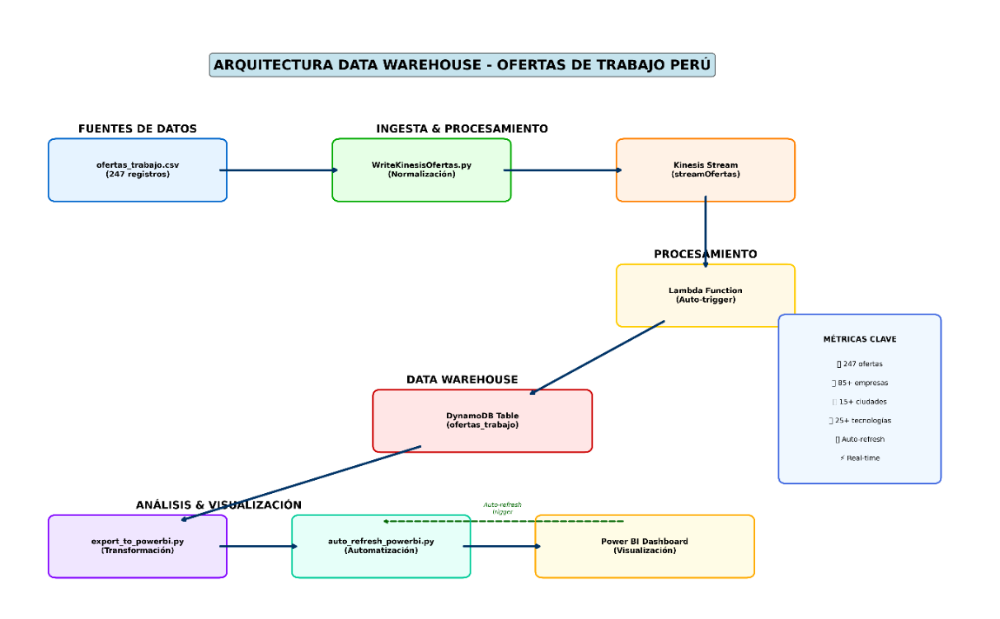
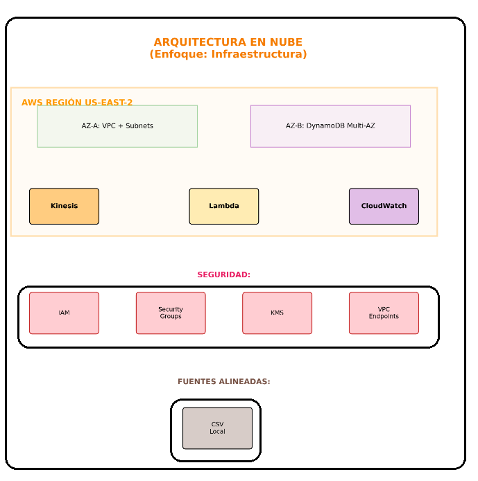

<!-- TÍTULO -->
# 📘 Plataforma de Análisis del Mercado Laboral Tecnológico  
 

## Integrantes: 
### Andree Sebastian Flores Melendez                                    (2017057494)
### Daleska Nicolle Fernandez Villanueva                              (2021070308)
### Mario Antonio Flores Ramos  (2018000597)

---

<!-- PROBLEMÁTICA -->
## ❗ Problemática

La falta de información clara y centralizada sobre el mercado laboral tecnológico genera un obstáculo triple. Afecta a los futuros profesionales, que no saben en qué especializarse; a las universidades, cuyos planes de estudio pierden vigencia; y a las empresas, que no pueden crecer por falta de personal. La importancia de resolverlo radica en que de ello depende la competitividad de toda la industria y el desarrollo profesional de sus miembros.

---

<!-- OBJETIVOS -->
## 🎯 Objetivos

### Objetivo General:
- Desarrollar una plataforma interactiva que analiza el mercado laboral tecnológico de Perú para guiar las decisiones estratégicas de estudiantes, profesionales y empresas.

### Objetivos Específicos:
- ✅ Permitir a los usuarios visualizar de forma clara cuáles son los roles y categorías de puestos con mayor demanda en el mercado TI peruano.

- Analizar y destacar las habilidades y tecnologías más requeridas por las empresas en las diferentes ofertas, ayudando a los profesionales y estudiantes a enfocar su aprendizaje y desarrollo.

---

- ✅ Facilitar la visualización de la distribución de las ofertas laborales del sector tecnológico a lo largo de las diferentes regiones del Perú. Esto ayudará a los usuarios a evaluar las oportunidades por ubicación, entender dónde se concentra la demanda para ciertos perfiles y tomar decisiones informadas sobre posibles reubicaciones o enfoque geográfico en su búsqueda de empleo.

- ✅ Proveer gráficos y visualizaciones interactivas que muestren rangos y promedios salariales (cuando la información esté disponible) para diferentes especializaciones, roles y niveles de experiencia dentro del campo tecnológico. Este análisis ayudará a los usuarios a comprender mejor las expectativas salariales en su área y región, y a negociar de manera más informada.

---

<!-- DIAGRAMA DE BASE DE DATOS -->
## 🗃️ Arquitectura de Data WareHouse

> *Este diagrama muestra las tablas y relaciones principales.*

---

<!-- DIAGRAMA DE ARQUITECTURA -->
## 🏗️ Diagrama de Arquitectura en la Nube

---

## 🙌 ¡Gracias!
